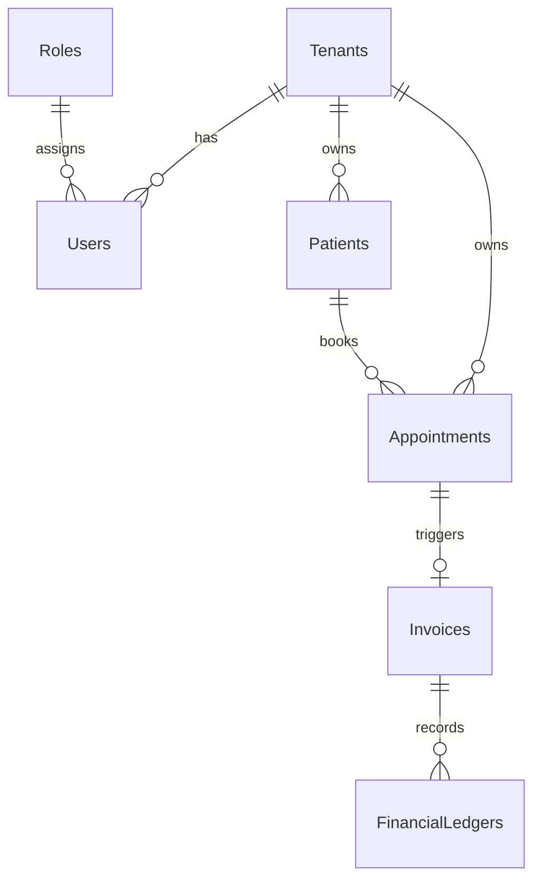

# Database Design: HPMS

## 1. Overview

HPMS uses a **shared database, shared schema** multi-tenancy model. Every tenant-scoped table includes a `TenantId` column. Isolation is enforced by EF Core global query filters (see [DESIGN.md](DESIGN.md)).

Three separate **DbContexts** share one connection string (`HPMS_Dev` locally):

| DbContext | Module | Migrations folder |
|-----------|--------|-------------------|
| `IdentityDbContext` | Identity | `HPMS.Modules.Identity/Migrations/` |
| `SchedulingDbContext` | Scheduling | `HPMS.Scheduling/Migrations/` |
| `BillingDbContext` | Billing | `HPMS.Modules.Billing/Migrations/` |

Tables marked **(planned)** are documented in requirements but not yet migrated.

---

## 2. Global & Infrastructure Tables

### `Tenants` — implemented

| Column | Type | Description |
|--------|------|-------------|
| **Id** (PK) | uniqueidentifier | Clinic identifier |
| **Name** | nvarchar | Practice name |
| **IsActive** | bit | Active flag (default true) |
| **CreatedAt** | datetime2 | Onboarding timestamp |

Entity: `HPMS.Modules.Identity/Entities/Tenant.cs`

> **Planned (not in schema):** `ApiKey` for external integrations.

### `AuditLogs` — planned (Phase 5)

| Column | Type | Description |
|--------|------|-------------|
| **Id** (PK) | bigint | Log identifier |
| **TenantId** (FK) | uniqueidentifier | Clinic |
| **EntityName** | nvarchar | Table name |
| **EntityId** | nvarchar | Record PK |
| **UserId** (FK) | uniqueidentifier | Actor |
| **Action** | nvarchar | Create, Update, Delete |
| **OldValues** | nvarchar(max) | JSON before change |
| **NewValues** | nvarchar(max) | JSON after change |
| **Timestamp** | datetime2 | Event time |

---

## 3. Identity Module

### `Roles` — implemented

Seeded values: SystemAdmin (1), ClinicAdmin (2), Provider (3), BillingManager (4), FrontDesk (5).

### `Users` — implemented

| Column | Type | Description |
|--------|------|-------------|
| **Id** (PK) | uniqueidentifier | User identifier |
| **TenantId** (FK) | uniqueidentifier | Clinic |
| **Username** | nvarchar | Login name |
| **Email** | nvarchar | Email address |
| **FirstName** | nvarchar | Given name |
| **LastName** | nvarchar | Family name |
| **PasswordHash** | nvarchar(max) | BCrypt hash |
| **RoleId** (FK) | int | Role reference |
| **IsDeleted** | bit | Soft-delete flag |

Entity: `HPMS.Modules.Identity/Entities/User.cs`

---

## 4. Scheduling Module

### `Patients` — implemented

| Column | Type | Description |
|--------|------|-------------|
| **Id** (PK) | uniqueidentifier | Patient identifier |
| **TenantId** (FK) | uniqueidentifier | Clinic |
| **FirstName** | nvarchar | Plain-text name (searchable) |
| **LastName** | nvarchar | Plain-text name |
| **DateOfBirth** | datetime2 | Date of birth |
| **PHI_Data** | nvarchar(max) | **AES-256 encrypted** JSON (`PatientPhi`: address, email, phone, SSN, insurance, emergency contact) |
| **IsDeleted** | bit | Soft-delete flag |

Entity: `HPMS.Scheduling/Entities/Patient.cs`  
PHI structure: `HPMS.Scheduling/Data/PatientPhi.cs`

### `Appointments` — implemented

| Column | Type | Description |
|--------|------|-------------|
| **Id** (PK) | uniqueidentifier | Appointment identifier |
| **TenantId** (FK) | uniqueidentifier | Clinic |
| **PatientId** (FK) | uniqueidentifier | Patient reference |
| **ProviderId** | uniqueidentifier | Provider user ID (no FK yet) |
| **StartTime** | datetime2 | Start |
| **EndTime** | datetime2 | End |
| **Status** | int | Enum: Scheduled(1), Arrived(2), InSession(3), Completed(4), NoShow(5), Canceled(6) |
| **RowVersion** | rowversion | Optimistic concurrency |
| **IsDeleted** | bit | Soft-delete flag |

Entity: `HPMS.Scheduling/Entities/Appointment.cs`

### `AppointmentTypes` — planned

Would store configurable visit rates referenced by appointments. Currently replaced by hardcoded `VisitFee = 150.00m` on `AppointmentCompletedEvent`.

---

## 5. Billing Module

### `Invoices` — implemented

| Column | Type | Description |
|--------|------|-------------|
| **Id** (PK) | uniqueidentifier | Invoice identifier |
| **TenantId** (FK) | uniqueidentifier | Clinic |
| **AppointmentId** (FK) | uniqueidentifier | Source appointment |
| **PatientId** (FK) | uniqueidentifier | Patient |
| **Amount** | decimal(18,2) | Charge amount |
| **DateGenerated** | datetime2 | Creation time |
| **Status** | int | Pending(1), Paid(2), Overdue(3), Canceled(4) |
| **IsDeleted** | bit | Soft-delete flag |

Entity: `HPMS.Modules.Billing/Entities/Invoice.cs`

> Design doc previously listed `Draft`/`Open`/`Void` statuses — the implemented enum uses **Pending**, **Paid**, **Overdue**, **Canceled**.

### `FinancialLedgers` — implemented

| Column | Type | Description |
|--------|------|-------------|
| **Id** (PK) | bigint | Entry identifier |
| **TenantId** (FK) | uniqueidentifier | Clinic |
| **InvoiceId** (FK) | uniqueidentifier | Related invoice |
| **Amount** | decimal(18,2) | Transaction value |
| **Type** | nvarchar | `Debit` (charge) or `Credit` (payment) |
| **CreatedAt** | datetime2 | Immutable timestamp |

Entity: `HPMS.Modules.Billing/Entities/FinancialLedger.cs`

Table name in EF: `FinancialLedgers`.

---

## 6. Implementation Notes

1. **Soft deletes:** Identity, Scheduling, and Billing entities use `ISoftDelete`. Rows are flagged, not physically removed.

2. **Concurrency:** `Appointments.RowVersion` supports optimistic concurrency. Conflict detection for double-booking is also handled in `AppointmentConflictService` before insert.

3. **Indexing:** Non-clustered indexes on `TenantId` and `IsDeleted` are planned for Phase 5 performance work; verify in migration snapshots before assuming they exist.

4. **Cross-module references:** `Appointment.ProviderId` and `Invoice.AppointmentId` are stored as GUIDs without cross-context foreign keys, preserving module boundaries.

5. **Auto-migration:** `HPMS.Web/Program.cs` runs `Database.Migrate()` for all three contexts on startup. CI applies Identity and Scheduling migrations explicitly; Billing relies on startup migration or manual `dotnet ef database update`.

---

## 7. Entity relationship (implemented tables)

See [API.md](API.md) for how these entities are exposed over HTTP.
